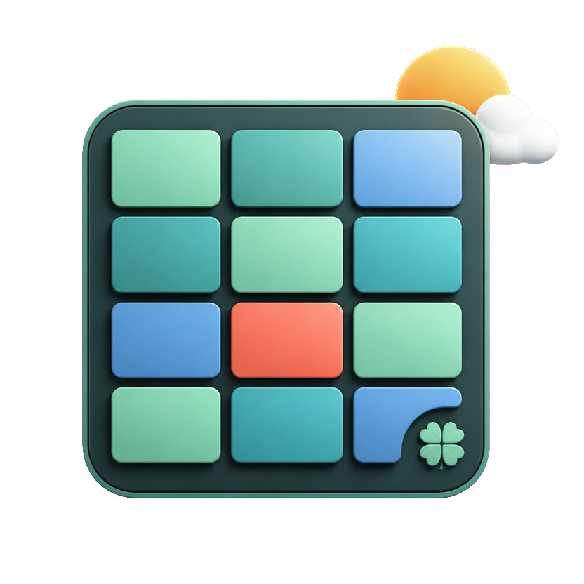
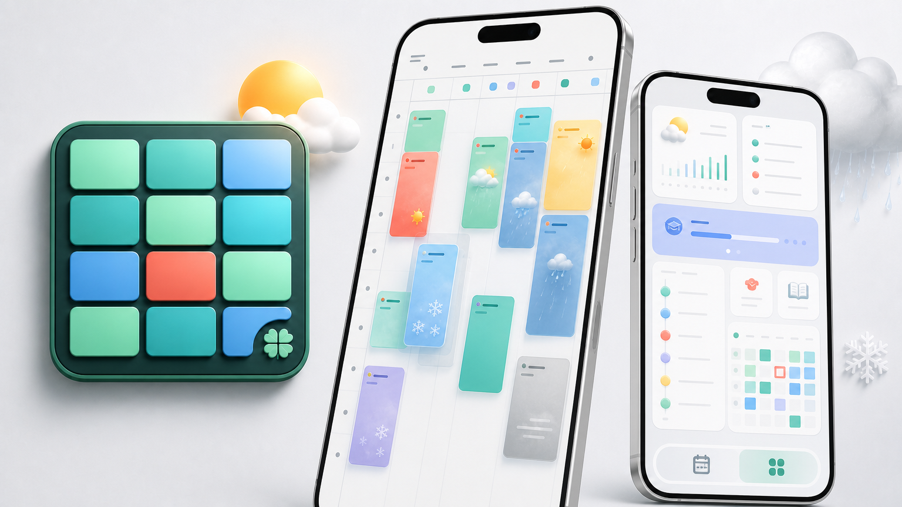

<p align="center">
  
</p>

<h1 align="center">Yotsuba Kit Web 演示与消费验证</h1>

<p align="center">Vue、React 与原生 Web 的移动端课表、Today 看板和正式依赖消费示例。</p>

<p align="center">
  
</p>

Yotsuba Kit Playground 是组件库的独立 Web 消费方：一方面提供可直接运行的 Vue、React 与原生 HTML 示例，另一方面持续验证 `@iyotsuba/schedule-*` 从 NPM Registry 安装后的类型、样式、事件和构建结果。

这里不复制组件库源码。所有界面都通过正式公开 API 组装，因此既可以作为接入范例，也能及时发现本地源码联调无法暴露的包导出、声明文件、跨包依赖和运行时样式问题。

## 快速入口

| 入口 | 地址 | 说明 |
| --- | --- | --- |
| **在线 H5 示例** | [iyotsuba.top](https://iyotsuba.top/) | 无需登录或微信校验，直接体验 Vue 全功能演示 |
| **官网文档** | [isla4ever.github.io/yotsuba-kit](https://isla4ever.github.io/yotsuba-kit/) | 组件指南、框架接入、API 与发布状态 |
| **Vue 示例源码** | [`vue-app/`](vue-app) | 课表、Today、天气、编辑、引导与设置的完整移动端示例 |
| **React 示例源码** | [`react-app/`](react-app) | React 类型化绑定与受控状态示例 |
| **原生 HTML 示例** | [`vanilla.html`](vanilla.html) | 使用 Custom Elements 的零框架示例 |
| **组件库源码** | [yotsuba-kit](https://github.com/isla4ever/yotsuba-kit) | Core、Vue、React、Elements 与官网文档 |

## 第一次运行

```bash
pnpm install --frozen-lockfile
pnpm test
pnpm dev:vue
```

启动后按终端地址打开 Vue 示例。React 示例使用 `pnpm dev:react`，原生示例可直接打开 `vanilla.html`；生产构建统一执行 `pnpm build`。

## Yotsuba 项目关系

| 项目 | 定位 |
| --- | --- |
| **[yotsuba-kit](https://github.com/isla4ever/yotsuba-kit)** | Web 主体组件库、NPM 包和文档官网 |
| **[yotsuba-kit-playground](https://github.com/isla4ever/yotsuba-kit-playground)** | 当前仓库：Vue / React / 原生 Web 演示与依赖消费验证 |
| **[yotsuba-kit-flutter](https://github.com/isla4ever/yotsuba-kit-flutter)** | Flutter 组件包、完整应用和 Flutter 演示 |

当前演示基线为 `@iyotsuba/schedule-* 0.7.2`，Vue、React 与 Core 依赖均从 NPM Registry 安装；Flutter 对应版本为 `yotsuba_schedule_kit 0.7.2`。

## 演示内容

| 目录 | 内容 |
| --- | --- |
| `vue-app/` | Vue 全功能演示：课表 / 今日 / 设置、天气、教材、携带物、课程任务、详情弹层、编辑、日计划、背景、引导、ICS 和分享码 |
| `react-app/` | React 类型化绑定演示：受控周次、天气课程卡、详情、Today 任务和触摸排版 |
| `vanilla.html` | 原生 HTML 与 `<ys-schedule>` 自定义元素的零构建示例 |
| `test/` | core、ICS、分享码、提醒、Vue 挂载和编辑事件的消费方测试 |

Vue 演示的设置项直接绑定 `@iyotsuba/schedule-vue` Props，不是只修改演示应用外层样式。长期默认放在设置中，高频调整保留在对应模块：周 Header 切换档位，课程详情切换精简 / 适中 / 全面，弹层 Header 调整位置，Today 通过长按或 Header 入口编辑布局。

Vue 与 React 的 Today 默认覆盖 `1x1 / 1x2 / 2x1 / 2x2` 四种尺寸。内置「本周一览」在大卡展示七日课程柱状图；Vue 额外通过 `#widget-study-load` 演示自定义内容如何根据 `layout.columns / rows` 在数字、列表和图表之间切换。

## 本地联调与发布验证

仓库默认精确消费 NPM Registry 中的 `0.7.2` 正式包，锁文件同时记录每个包的完整性校验。需要联调组件库源码时，可以临时连接相邻的 `yotsuba-kit` 工作树，但联调链接不应提交，也不能作为发版验收结果。

正式发布验收必须从干净安装开始，确认锁文件不存在 `link:` 或 `file:`，再执行消费方测试和 Vue / React 双端构建。只有消费的是 Registry 产物，才能证明包导出、声明文件、跨包依赖和运行时样式真实可用。

```bash
pnpm install --frozen-lockfile
pnpm test
pnpm build
```

每日 CI 会重新解析兼容范围内的最新发布版本，并拉取 `yotsuba-kit` 当前主分支构建
Vue / React 的源码联调依赖；随后统一运行消费方测试和双端构建，用于尽早发现已发布版本
或主分支 API 的破坏。

## 移动端交互边界

- 天气按钮只在用户主动点击后申请定位，再由宿主调用 Open-Meteo 或其他 Provider。
- 同一份天气快照驱动 Header、星期预报、课程卡、背景场景、详情和 Today。
- Today 面向触摸：整卡拖动、智能让位和四角缩放，不绑定桌面方向键。
- 导出、分享、系统日历、通知和持久化均由演示应用作为宿主接管。

## License

本仓库演示代码采用 [MIT](LICENSE)；组件库许可证见 [yotsuba-kit](https://github.com/isla4ever/yotsuba-kit)。
